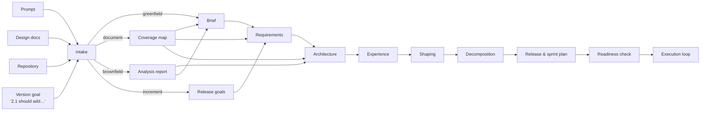

# qdev Planning Pipeline

> How an idea, a design document, or an existing codebase becomes requirements, architecture, epics, stories, and sprints, and how a version goal such as "2.1 should add the ability to…" becomes one or more planned sprints. This document covers everything upstream of the story execution loop in [architecture.md](architecture.md) §4.

## Table of Contents

- [Principles](#principles)
- [Entry Modes](#entry-modes)
- [The Pipeline](#pipeline)
- [Stage Detail](#stages)
- [Version-Scoped Planning](#versions)
- [Elicitation & Synthesis Engine](#elicitation)
- [New Entities & Relations](#entities)
- [CLI & Skill Surface](#surface)
- [Worked Examples](#examples)
- [Feedback Loops](#feedback)
- [Impact on Existing Documents](#impact)

---

<a id="principles"></a>

## 1. Principles

1. **Entities, not prose.** Every stage emits qdev entities (requirements, ADRs, pitches, epics, stories), never a monolithic document. Prose documents are rendered views of entities, generated on demand.
2. **Provenance on everything.** Each planning entity records where it came from: a prompt, a document section, a code location, or a conversation turn. Nothing is untraceable.
3. **Draft first, human bets.** Agents create entities in `draft`. Humans promote them. Nothing an agent proposes becomes binding without a promotion, and express-mode assumptions are logged as decisions so they can be reviewed later.
4. **Negative space from the start.** Appetite, rabbit holes, and no-gos are captured when work is shaped, not retro-fitted at story time. Epic constraints originate in pitches.
5. **Stages have readiness checks, not ceremonies.** A stage is complete when its checklist passes, whatever order the work happened in. You can enter at any stage and go back to any stage.
6. **Versions are first-class.** Requirements, epics, and sprints are scoped to releases, so "what does 2.1 add" is a query, not an archaeology exercise.
7. **Budgets apply to planning too.** Every planning skill uses `qdev context` projections, so a story-decomposition prompt sees the epic, its pitch, and governing ADRs, not the whole PRD.

The pipeline borrows deliberately: the artifact ladder from BMAD (brief → PRD → architecture → UX → epics → stories → sprint plan), shaping and betting from Shape Up (pitches with appetite, rabbit holes, no-gos, and a betting table), Working Backwards from Amazon (an optional PRFAQ at the brief stage), User Story Mapping (a backbone with walking-skeleton slices to find increments), and the C4 model (context and container views to derive the module registry in brownfield analysis).

---

<a id="entry-modes"></a>

## 2. Entry Modes

`qdev plan intake` classifies the inputs and chooses where the pipeline starts. There are four modes, and they combine.

| Mode | Input | Starts at | What intake does |
| --- | --- | --- | --- |
| **Greenfield** | A few lines of prompt | Brief | Opens guided elicitation; records the prompt as the root source |
| **Document** | One or more design documents at any maturity | Wherever coverage ends | Maps sections onto pipeline artifacts, produces a coverage map, drafts entities for covered stages, lists gaps as questions |
| **Brownfield** | An existing repository | Architecture, then Brief backwards | Deterministic scan of build system, modules, dependencies, tests, docs, and TODO debt; drafts the module registry, candidate ADRs, candidate requirements, candidate gates, and deferred work |
| **Increment** | An existing qdev workspace plus a version goal | Release goals | Runs the delta pipeline against the current baseline (see §5) |



Intake always produces an **Intake Record** (`INTAKE-n`): mode, sources, detected stage coverage, and open questions. It is the audit anchor for everything the pipeline creates.

---

<a id="pipeline"></a>

## 3. The Pipeline

| # | Stage | Question answered | Primary outputs | Readiness check passes when |
| --- | --- | --- | --- | --- |
| 0 | **Intake** | What do we have and where do we start? | `INTAKE-n`, coverage map | Mode chosen, sources recorded, questions listed |
| 1 | **Brief** | Why, for whom, what outcome, how big? | `BRIEF-n` (problem, users, outcomes, product appetite, non-goals), optional PRFAQ | Problem, at least one persona, at least one measurable outcome, non-goals present |
| 2 | **Requirements** | What must be true? | `PRD-n`, `FR-n`, `NFR-n`, personas, success metrics, each requirement tagged with a release | Every requirement has a rationale, a source, a release, and a verification approach; no orphan personas |
| 3 | **Architecture** | What is fixed so parts stay consistent? | Spine `AD-n`, module registry, `ADR-n` for local decisions, `HAZ-n` risks, candidate gates | Every module has paths; every AD has binds and prevents; every ClassB/C requirement has at least one hazard or an explicit "no hazard" decision |
| 4 | **Experience** (optional) | How does it behave for the user? | `UX-n` flows and state machines, degraded modes | Every user-facing FR has a flow; every flow names its error and degraded states |
| 5 | **Shaping** | What bets are we making and how bounded? | `PITCH-n`: problem, appetite, solution sketch, rabbit holes, no-gos, addressed requirements; red-team notes | Every pitch has appetite, at least one rabbit hole or no-go, and addresses at least one requirement; a pre-mortem has been recorded |
| 6 | **Decomposition** | What are the units of work and their order? | `E-n` epics realising pitches, `EnSm` stories with ACs, constraints, `traces_to`, `depends_on`; story map backbone; parallel tracks | Every story `ready`-eligible per state machine; every addressed FR traced by at least one story; no cycles; every story has target modules |
| 7 | **Release & sprint planning** | Which bets ship in which version, and when? | Release scope (`includes` epics), sprint proposals with assignments, capacity plan | Every epic in the release has stories; every sprint within capacity; cross-sprint dependencies point backwards only |
| 8 | **Readiness check** | Can execution start? | `qdev plan check` report | Zero blocking findings for the release |

Stages 1–4 are **discovery**; 5–7 are **planning**; 8 is the handoff. Discovery is skipped or shortened when intake finds coverage; planning is never skipped.

---

<a id="stages"></a>

## 4. Stage Detail

### Stage 0: Intake

```
qdev plan intake [--prompt "…"] [--docs a.md b.pdf] [--repo .] [--release 2.1 --goal "…"] [--mode guided|express|headless]
```

- **Document ingestion.** The intake skill reads each document and produces a coverage map: for each pipeline stage, `covered | partial | absent`, with the section references that cover it. Covered sections are drafted into entities with `sources: [{type: document, ref: "design.md#4.2"}]`. Partial stages generate targeted questions rather than a full elicitation.
- **Brownfield analysis** (`qdev plan analyse`) is deterministic and needs no model:
  - Build system and workspace members (Cargo, SwiftPM, npm workspaces, Gradle, Go modules) → candidate `[[modules]]` with paths.
  - Import graph between candidates → proposed `layer` and `may_depend_on`, with cycles flagged.
  - Existing ADR directories, README, CHANGELOG, doc comments → candidate ADRs and requirements with source refs.
  - Test targets and CI config → candidate gates.
  - `TODO`/`FIXME`/`HACK` → candidate deferred work with module and location.
  - Dependency manifests → SOUP inventory.
  The analysis skill then interprets the report: names modules, writes AD rules, phrases requirements. All output is `draft`.
- **Combined modes.** A brownfield repository plus a design document plus a version goal is the normal case for an established product; intake merges the three source sets under one intake record.

### Stage 1: Brief

Guided elicitation asks, in rounds, using the synthesis engine (§6): the problem and who has it, the outcome and how it will be measured, product-level appetite (weeks or a release), hard constraints (platform, regulatory class, offline), and non-goals. Optionally drafts a PRFAQ: the press release, customer FAQ, and internal FAQ, which is stored as sections of the brief.

Output is `BRIEF-n`. Impact mapping (why → who → how → what) is the default structure because it forces outcomes before features.

### Stage 2: Requirements

Requirements are created one entity each:

```yaml
---
id: FR-140
title: Export session as PDF report
kind: functional            # functional | non_functional
status: draft
release: "2.1"              # introduced in
changed_in: []
retired_in: null
personas: ["clinician"]
rationale: Clinicians need a printable record for the patient file.
verification: gate           # gate | review | demo | analysis
sources:
  - {type: brief, ref: "BRIEF-1#outcomes"}
  - {type: conversation, ref: "INTAKE-3#q7"}
---
```

The PRD entity holds vision, personas, success metrics, and out-of-scope, and `owns` its requirements. `qdev render prd PRD-1` produces the classic document view when someone needs one.

### Stage 3: Architecture

Produces or updates the spine, the module registry, ADRs, and hazards. In greenfield mode the architecture skill proposes modules from the requirements and the chosen paradigm; in brownfield mode it starts from the analysis report. Hazard identification runs for any project with `regulatory.iec62304_class` set: for each requirement the skill asks what happens if it fails, and records either a `HAZ-n` or a decision "no hazard identified" so the absence is deliberate.

### Stage 4: Experience

Optional, entered only when requirements have user-facing personas. `UX-n` entities capture flows as state machines (states, transitions, error and degraded paths) in frontmatter, with sketches in the body. Stories later `implements` a flow, which makes "which stories touch the safety HUD" a query.

### Stage 5: Shaping

This is where Shape Up enters and where epic constraints are born. A pitch bundles a cluster of requirements into a bet:

```yaml
---
id: PITCH-7
title: PDF session export
status: shaped               # draft | shaped | bet | dropped
appetite: medium             # tiny | small | medium | deep, product-level scale
addresses: ["FR-140", "FR-141", "NFR-22"]
solution_sketch: |
  Render from the existing session model via a headless layout crate; no new UI beyond a button.
rabbit_holes:
  - id: RH-1
    text: Custom typography engine; use the platform PDF API
  - id: RH-2
    text: Editable report templates
no_gos:
  - id: NG-1
    text: No network upload of the report in this version
red_team:
  - Pre-mortem: platform PDF API lacks vector paths on Linux → fallback raster at 300 dpi acceptable per DEC-4a1f
sources: [{type: brief, ref: "BRIEF-1#outcomes"}]
---
```

Shaping ends with a **betting table**: `qdev plan bet --release 2.1` lists shaped pitches with appetite totals against release capacity; humans mark pitches `bet` or `dropped`. A pitch marked `bet` is realised by exactly one epic, which inherits its rabbit holes and no-gos as `E-n/RH-k` and `E-n/NG-k`. A red-team pass (pre-mortem and "what would make this a rabbit hole") is mandatory before a pitch can be bet.

### Stage 6: Decomposition

For each bet epic the decomposition skill runs with `qdev context E12 --phase specify`: it sees the pitch, addressed requirements, governing ADRs, and sibling stories, nothing else. It produces stories with acceptance criteria, story-level constraints, `traces_to`, `depends_on`, `implements` (UX), and `mitigates` (hazards).

Two techniques are built in:

- **Story mapping.** The skill first lays a backbone (user activities left to right) and then slices a walking skeleton: the thinnest end-to-end path. Skeleton stories get `depends_on` ordering first; enrichment stories hang off them. This is what makes an increment shippable early.
- **Parallel tracks.** `qdev graph --tracks` partitions the DAG into independent chains and labels each with the owning team, so sprint planning can run tracks concurrently.

Stories are created in `draft` and promoted to `ready` by the state machine's readiness rule.

### Stage 7: Release & Sprint Planning

Covered in §5.

### Stage 8: Readiness Check

`qdev plan check --release 2.1` runs every stage checklist for the release scope and `qdev validate`, and prints blocking and advisory findings. It is the planning equivalent of a gate: `/qdev-develop` refuses to start a story in a release that has blocking findings unless overridden with a justification.

---

<a id="versions"></a>

## 5. Version-Scoped Planning

### Release goals

A release is created with goals in plain language:

```
qdev release create 2.1 --base 2.0
qdev release goal add 2.1 -- "Add the ability to export a session as a PDF report"
qdev release goal add 2.1 -- "Reduce cold start below 800 ms on the reference tablet"
```

Goals are stored on the release (`GOAL-k` within the release). They are the intake for the increment pipeline.

### The increment pipeline

`qdev plan increment 2.1` runs the delta form of stages 1–7:

1. **Baseline.** Loads the 2.0 release snapshot (requirements, modules, ADRs, hazards, open deferred work) and, if the workspace is a repository, a fresh brownfield analysis diffed against the snapshot so drift since 2.0 is visible.
2. **Goal → requirements.** For each goal, elicits or drafts new requirements tagged `release: "2.1"`, and identifies existing requirements that change (`changed_in: ["2.1"]`) or retire (`retired_in: "2.1"`). Changing a requirement creates a `DEC-` record and lists stories that traced to the old version, which become impact candidates.
3. **Architecture delta.** Proposes new or amended ADs and ADRs, module additions, and new hazards. Amending an AD requires a decision with justification; the old text is preserved in the ADR history.
4. **Shaping and betting.** Drafts pitches per goal, runs the red team, and opens the betting table for 2.1 with the release capacity.
5. **Decomposition** of bet epics as in Stage 6. Open deferred work in affected modules is offered for inclusion via `closes_dw`.
6. **Sprint cutting** (below).
7. **Readiness check** for 2.1.

Requirements therefore version by tags, not by copies. "What does 2.1 add" is `qdev list requirements --release 2.1`; "what did 2.1 change" is `--changed-in 2.1`; the traceability matrix for a release includes introduced and changed requirements.

### Sprint cutting

```
qdev sprint plan --release 2.1 [--capacity 21] [--sprint-length 2w] [--teams core-platform,ui-shell] [--apply]
```

1. Collect all `ready`-eligible stories in epics the release `includes`.
2. Size each story from appetite using `[planning] appetite_points` (default tiny 1, small 2, medium 5, deep 8) unless a story carries an explicit `estimate`.
3. Topologically sort by `depends_on`; walking-skeleton stories first within a layer.
4. Partition into parallel tracks by owning team; fill each team's sprint up to its capacity, never placing a story before its dependencies' sprints.
5. Emit a proposal: sprints with assignments, per-team load, the critical path, stories that do not fit, and which goal each sprint advances.
6. `--apply` creates the sprint entities and assignments. Without it, nothing is written.

Humans edit the proposal by moving stories (`qdev sprint assign`) and re-running the check. A release whose critical path exceeds its target date is reported, and the betting table can be reopened to drop a pitch.

### Patch tracks

A patch release (`2.0.1 --base 2.0`) runs the same pipeline with a single goal and typically one sprint, in parallel with 2.1 work. Sprints are assignments, so the same story can never be in two active sprints, and `qdev next --sprint` keeps agents on the right track.

---

<a id="elicitation"></a>

## 6. Elicitation & Synthesis Engine

Every planning skill runs through one engine with three modes:

| Mode | Behaviour | Use |
| --- | --- | --- |
| `guided` | Asks questions in rounds, at most five per round, each tagged with the stage checklist item it satisfies; stops when the checklist passes | Greenfield, high-stakes stages |
| `express` | Makes reasonable assumptions, logs each as a `DEC-` of type `agent_assumption` against the entity it affected, and proceeds | Document and brownfield modes, low-risk stages |
| `headless` | No questions, no assumptions beyond configured defaults; fails the stage check on gaps | CI regeneration, repeatability tests |

**Structured Multi-Perspective Synthesis** replaces persona role-play. The perspective set is configured per stage:

```toml
[synthesis]
brief        = ["product", "user", "risk"]
requirements = ["product", "architecture", "compliance", "ops"]
architecture = ["architecture", "safety", "ops", "cost"]
shaping      = ["product", "architecture", "risk", "red_team"]
decomposition = ["architecture", "qa", "developer"]
```

Each perspective is a heading the model must fill, with a one-line brief describing its concerns. Domain-specific perspectives (for example `clinical`) are added in configuration. Output missing a heading is rejected and re-prompted.

**Advanced elicitation** techniques (pre-mortem, first principles, Socratic challenge, inversion) are available as `qdev plan challenge <entity> --technique pre-mortem` and are required by the shaping stage's red-team check. Results are appended to the entity's `red_team` or `challenges` section with provenance.

**Assumption review.** `qdev plan assumptions --release 2.1` lists every express-mode assumption for human confirmation; confirming converts the decision type to `human_ruling`, rejecting reopens the affected entity to `draft`.

---

<a id="entities"></a>

## 7. New Entities & Relations

| Entity | ID | Lives in | Notes |
| --- | --- | --- | --- |
| Intake record | `INTAKE-n` | `docs/state/intake/` | Mode, sources, coverage map, questions |
| Brief | `BRIEF-n` | `docs/specs/briefs/` | Problem, personas, outcomes, appetite, non-goals, optional PRFAQ |
| Analysis report | `ANALYSIS-n` | `docs/state/analysis/` | Brownfield scan output; regenerated per increment |
| UX flow | `UX-n` | `docs/specs/ux/` | State machine in frontmatter |
| Pitch | `PITCH-n` | `docs/specs/pitches/` | Appetite, sketch, rabbit holes, no-gos, red team, status |
| Release goal | `GOAL-k` within release | Release frontmatter | Plain-language goals |
| Change proposal | `SCP-n` | `docs/state/change-proposals/` | See §10 |
| Retrospective | `RETRO-n` | `docs/state/retros/` | See §10 |

Requirements gain `release`, `changed_in`, `retired_in`, `verification`, `personas`, `sources`. Every planning entity gains `sources`.

| Relation | Source → Target | Semantics |
| --- | --- | --- |
| `owns` | PRD → Requirement | PRD scope |
| `addresses` | Pitch → Requirement | What the bet delivers |
| `realises` | Epic → Pitch | One epic per bet pitch; constraints inherited |
| `includes` | Release → Epic | Release scope |
| `implements` | Story → UX flow | UX traceability |
| `derived_from` | Any → Intake/Brief/Analysis | Provenance shortcut for queries |

`traces_to`, `verifies`, `mitigates`, `depends_on`, `extends`, `supersedes`, `governed_by`, `closes_dw` are unchanged from [architecture.md](architecture.md) §8.

---

<a id="surface"></a>

## 8. CLI & Skill Surface

### CLI

| Command | Purpose |
| --- | --- |
| `qdev plan intake …` | Classify inputs, create intake record and coverage map |
| `qdev plan analyse [--repo .] [--diff-against 2.0]` | Deterministic brownfield scan |
| `qdev plan status [--release 2.1]` | Stage coverage and checklist state |
| `qdev plan check --release 2.1` | Readiness findings; exit 1 on blocking |
| `qdev plan bet --release 2.1` | Betting table view; `--bet PITCH-7`, `--drop PITCH-9` |
| `qdev plan challenge <id> --technique …` | Record an adversarial pass |
| `qdev plan assumptions --release 2.1 [--confirm DEC-…]` | Review express-mode assumptions |
| `qdev plan increment 2.1 [--mode …]` | Run the delta pipeline for a release |
| `qdev release create 2.1 --base 2.0` / `qdev release goal add 2.1 -- "…"` | Release and goals |
| `qdev release include 2.1 E12` | Scope an epic to a release |
| `qdev sprint plan --release 2.1 [--capacity N] [--apply]` | Cut sprints from the DAG |
| `qdev render prd PRD-1 | brief BRIEF-1 | pitch PITCH-7 | rtm 2.1` | Prose views of entities |
| `qdev create brief|pitch|ux|requirement …` | Manual entity creation |
| `qdev graph --tracks [--release 2.1]` | Parallel track partition |

Everything is `--json`, non-interactive capable, and writes only `draft` entities unless `--apply` or a promotion command is used.

### Skills

| Skill | Stage | Model hint |
| --- | --- | --- |
| `/qdev-plan` | Orchestrator: runs intake, then the next incomplete stage, showing `plan status` between stages | reasoning |
| `/qdev-plan intake` | Stage 0, document coverage mapping, brownfield interpretation | reasoning |
| `/qdev-plan brief` | Stage 1, optional PRFAQ | reasoning |
| `/qdev-plan requirements` | Stage 2 | reasoning |
| `/qdev-plan architecture` | Stage 3 | reasoning |
| `/qdev-plan ux` | Stage 4 | reasoning |
| `/qdev-plan shape` | Stage 5 including red team and betting table | reasoning |
| `/qdev-plan decompose E12` | Stage 6 for one epic (replaces `/qdev-create-story` for bulk decomposition; `/qdev-create-story` remains for adding one story) | reasoning |
| `/qdev-plan sprints 2.1` | Stage 7 | fast |
| `/qdev-increment 2.1 "…"` | Shortcut: create release, add goal, run `plan increment` | reasoning |
| `/qdev-correct-course` | §10 | reasoning |
| `/qdev-retro E12` | §10 | reasoning |

Skills never assemble context from files; every prompt is built from `qdev context <id> --phase specify` or a stage-specific projection (`qdev context --stage shaping --release 2.1`).

---

<a id="examples"></a>

## 9. Worked Examples

### 9.1 Greenfield from a prompt

```
/qdev-plan "An offline-first note-taking app for field geologists with photo annotation and sync when back online"
```

1. Intake: mode `greenfield`, `INTAKE-1`, coverage all `absent`.
2. Brief (guided): three rounds of questions; produces `BRIEF-1` with two personas, three outcomes, appetite "first release in 8 weeks", non-goals (no collaboration, no web client).
3. Requirements (guided → express after round two): 14 FR, 6 NFR, all `release: "1.0"`.
4. Architecture: spine with 7 ADs, modules `core`, `storage`, `sync`, `ui`, `camera`; 3 hazards (data loss on sync conflict, photo orientation, offline clock drift).
5. Experience: 4 UX flows.
6. Shaping: 5 pitches; red team drops "background sync on cellular" into 1.1; betting table bets 4.
7. Decomposition: 4 epics, 31 stories, walking skeleton of 7 stories.
8. Sprint plan: capacity 20 points, two teams → 3 sprints, critical path 3 sprints, 2 stories deferred to 1.1.
9. `qdev plan check --release 1.0` passes; `/qdev-develop E1S1` starts.

### 9.2 From an existing design document

```
qdev plan intake --docs docs/design-v3.md docs/api-sketch.md --mode express
```

Coverage map: brief `covered`, requirements `partial` (no NFRs, no verification approach), architecture `covered`, UX `absent`, shaping `absent`. Intake drafts `BRIEF-1`, 22 FRs with `sources` pointing at document sections, the spine, and 12 ADRs; logs 9 assumptions; emits 6 questions about NFRs. The orchestrator resumes at Stage 2 with just those questions, then proceeds to shaping.

### 9.3 Brownfield adoption

```
qdev init && qdev plan analyse --repo .
```

`ANALYSIS-1` finds a Cargo workspace with 6 crates and a SwiftPM package, an import cycle between two crates, 41 TODOs, 3 CI jobs, and an `adr/` directory with 9 decisions. The architecture skill drafts `[[modules]]` with layers (flagging the cycle as `DW-…` with `unacceptable` risk pending review), 9 ADRs from the existing records, candidate gates from CI, and 41 deferred work items. The brief skill then works backwards from the README and CHANGELOG to a `BRIEF-1` and 30 requirements tagged with the current version, all `draft`. The human promotes what is accurate; the rest is corrected or dropped.

### 9.4 Version goal on an established product

```
/qdev-increment 2.1 "Add the ability to export a session as a PDF report"
```

1. `qdev release create 2.1 --base 2.0`, goal recorded.
2. Baseline loaded from the 2.0 snapshot; analysis diff shows one new crate added since 2.0 without an ADR → advisory finding.
3. Requirements: `FR-140`, `FR-141` introduced in 2.1; `NFR-22` (memory ceiling) changed in 2.1 with a decision; two stories from 1.x that traced to `NFR-22` listed as impact candidates.
4. Architecture delta: `ADR-31` chooses the platform PDF API; new module `report`; `HAZ-19` (report shows wrong patient) with a mitigation requirement.
5. Shaping: `PITCH-7` as in §4; red team records the Linux vector-path pre-mortem; betting table bets it against 2.1 capacity.
6. Decomposition: `E14` realises `PITCH-7`, inherits `E14/RH-1`, `E14/RH-2`, `E14/NG-1`; 9 stories, skeleton of 3; `E14S6` closes `DW-3c9e` (an old rendering TODO in the same module).
7. `qdev sprint plan --release 2.1 --capacity 18` proposes two sprints for core-platform and one for ui-shell in parallel; `--apply` creates sprints 12 and 13.
8. `qdev plan check --release 2.1` passes; `qdev next --sprint 12` returns `E14S1`.

---

<a id="feedback"></a>

## 10. Feedback Loops

**Course correction.** When execution reveals a wrong assumption, `/qdev-correct-course E14S4` produces a change proposal `SCP-n`: trigger, affected requirements, pitches, epics, stories, ADRs, and hazards (computed with `qdev impact`), options with appetite deltas, and a recommendation. Accepting an option applies the entity changes through the normal write path, logs a `DEC-` of type `human_ruling`, and, if the release critical path moved, reopens the betting table. Rejecting records why.

**Retrospective.** `/qdev-retro E14` at epic close reads stories, scratchpads, decisions, evidence, and deferred work created during the epic, and writes `RETRO-n` with sourced findings and action items. Action items become deferred work or new pitches, so they enter the next increment's intake automatically rather than living in a document nobody reads.

**Drift detection.** Each increment's brownfield analysis is diffed against the previous release snapshot, so modules, dependencies, and debt that changed without planning entities are surfaced before the next round of shaping.

---

<a id="impact"></a>

## 11. Impact on Existing Documents

Adopting this pipeline implies the following changes, not yet applied:

| Document | Change |
| --- | --- |
| [prd.md](bmad/planning-artifacts/prd-1/prd.md) | New FR-700s: intake and coverage mapping, brownfield analysis, briefs, pitches and betting, requirement versioning by release, sprint cutting, readiness check, change proposals, retrospectives. NFR: planning prompts built only from projections |
| [ARCHITECTURE-SPINE.md](bmad/planning-artifacts/architecture-1/ARCHITECTURE-SPINE.md) | AD-15 Planning entities carry provenance and start in draft; AD-16 Requirements version by release tags, never by copies; AD-17 Deterministic analysis in core, interpretation in skills |
| [architecture.md](architecture.md) | Entity catalog and relations extended per §7; on-disk layout adds `briefs/`, `pitches/`, `ux/`, `intake/`, `analysis/`, `change-proposals/`, `retros/`; projection gains `--stage` |
| [cli-reference.md](cli-reference.md) | Command catalog extended per §8; `[planning]` and `[synthesis]` config sections |
| [governance-and-teams.md](governance-and-teams.md) | Release section extended with goals, `includes`, and betting |
| [epics.md](bmad/planning-artifacts/epics.md) | New **Epic 5: Planning Pipeline** with stories for intake, analysis, brief, requirements versioning, pitches and betting, story mapping and tracks, sprint cutting, readiness check, render, challenge, assumptions, correct-course, retro, and the planning skills. Story 4.6's `/qdev-plan` becomes the orchestrator described here; Story 4.8's synthesis template becomes per-stage |
| [roadmap.md](roadmap.md) | Epic 5 placed after Epic 4 for v1, or split: intake, brief, requirements, pitches, decomposition, sprint cutting, and readiness in v1; UX, PRFAQ, retrospectives, drift detection in v1.1 |
